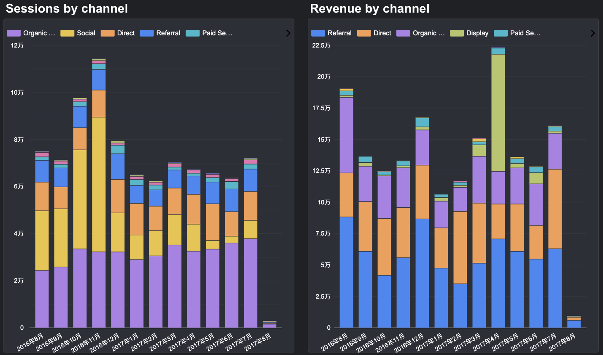
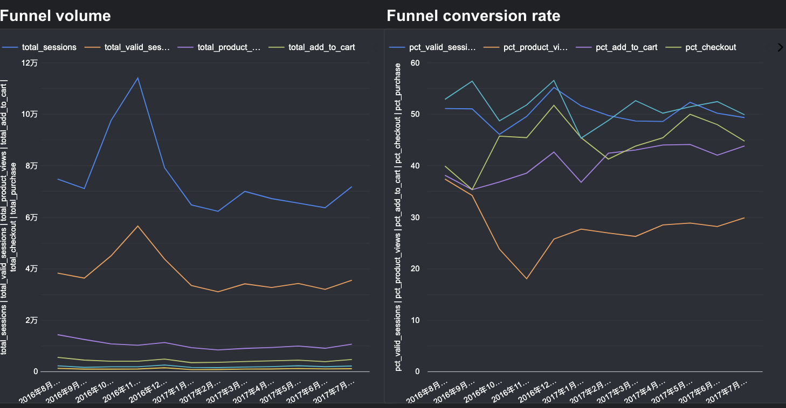
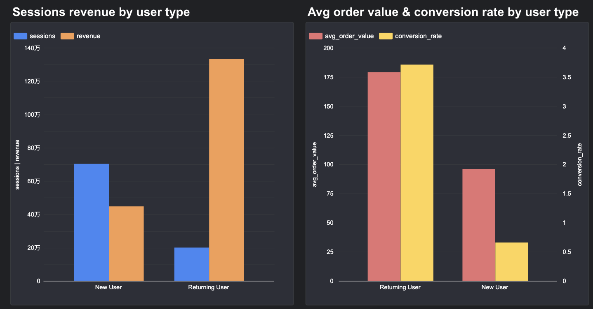

# Google Analytics E-commerce Analysis

  

Analysis of Google Merchandise Store user behavior and sales performance using Google Analytics 360 data exported to BigQuery.

**Period:** August 2016 – August 2017  
**Dataset:** [Google Analytics 360 Sample Dataset](https://console.cloud.google.com/marketplace/product/obfuscated-ga360-data/obfuscated-ga360-data)  
**Interactive Dashboard:** [View on Looker Studio](https://datastudio.google.com/reporting/3a1550b1-dd1d-438d-aac8-d8379a227d72)

---

## Project Overview
This project analyzes one year of Google Merchandise Store user behavior and sales performance using Google Analytics 360 data exported to BigQuery. The analysis covers traffic acquisition, sales funnel conversion, channel performance, device behavior, user type segmentation, and product category performance.

**Business Questions Answered:**
- Where does traffic come from, and which channels drive the most revenue?
- Where do users drop off in the purchase funnel?
- How do conversion rates differ by channel, device, and user type?
- Which product categories and products generate the most revenue?
- What anomalies exist in the data, and what do they reveal?

---

## Dataset
The dataset contains obfuscated Google Analytics 360 data from the Google Merchandise Store, a real e-commerce website selling Google-branded merchandise.

**Key statistics:**

| Metric | Value |
|---|---|
| Total Sessions | 903,653 |
| Total Users | 714,167 |
| Total Transactions | 12,115 |
| Total Revenue | $1,780,149 |
| Overall Conversion Rate | 1.3% |

**Data Quality Notes:**
- `(not set)` category accounts for $331,961 revenue — tracking gap in category attribution
- `${productitem.product.origCatName}` is an unrendered template variable indicating a website implementation bug
- April 2017 Display revenue spike caused by a single outlier user (99.5% of channel revenue)
- Checkout step data excluded due to inconsistent tracking in the obfuscated dataset

---

## Key Findings

### 1. Traffic & Revenue by Channel

- **Referral** generates the highest revenue despite lower traffic volume (~$60K–$90K/month)
- **Social** drives 25% of sessions but contributes less than 0.1% of revenue
- **October–November 2016** traffic spike was largely driven by the Social channel, which failed to convert to product views or revenue — indicating a surge in low-quality, low-intent traffic that diluted overall conversion metrics
- **April 2017 Display anomaly**: $93,243 revenue traced to a single user across 5 sessions, accounting for 99.5% of Display channel revenue that month. The visitor arrived via DoubleClick for Advertisers (DFA), suggesting a corporate procurement order rather than typical consumer behavior. Excluding this outlier, Display channel performance remains consistent with other months (~$500/month)

### 2. Sales Funnel Conversion

- Overall conversion rate averages **1.3%** across the analysis period, within the typical e-commerce benchmark range of 1–3%
- The largest drop-off occurs at the top of the funnel: approximately **50% of all sessions bounce** immediately without any meaningful engagement
- **December 2016** recorded the highest conversion rate at 1.76%, consistent with holiday shopping behavior
- **November 2016**, despite recording the highest traffic volume of the entire period (113,962 sessions), showed the lowest conversion rate at 0.81% — driven by low-intent Social traffic inflating session counts without corresponding purchase intent

### 3. Channel Performance

| Channel | Sessions | Conversion Rate | Valid Session Rate |
|---|---|---|---|
| Referral | 104,739 | 5.08% | 74.0% |
| Paid Search | 25,299 | 1.85% | 61.95% |
| Display | 6,259 | 2.28% | 64.12% |
| Direct | 142,907 | 1.44% | 50.41% |
| Organic Search | 381,259 | 0.90% | 51.65% |
| Social | 226,056 | 0.05% | 34.76% |
| Affiliates | 16,387 | 0.05% | 46.91% |

- **Referral** leads all channels at 5.08% conversion — 4x the site average — with a 74% valid session rate, indicating users arrive with clear purchase intent
- **Social** loses 65% of visitors at bounce; only 6.12% of valid sessions engage with products, suggesting Social users have no shopping intent
- **Affiliates** shows 6.52% checkout completion — the lowest of all channels — indicating poor partner quality and near-zero ROI
- **Paid Search** delivers strong quality metrics (61.95% valid session rate, 61.07% checkout completion) despite modest traffic volume, suggesting well-targeted keywords

### 4. Device Performance

| Device | Sessions | Conversion Rate | Checkout Completion |
|---|---|---|---|
| Desktop | 664,012 | 1.59% | 54.46% |
| Tablet | 30,426 | 0.55% | 43.52% |
| Mobile | 208,588 | 0.41% | 32.01% |

- Desktop converts **4x better** than mobile (1.59% vs 0.41%)
- Mobile accounts for 23% of traffic but only 8% of purchases
- Mobile checkout abandonment rate is nearly double that of desktop — suggesting UX friction from small screens, difficult checkout flows, or lack of saved payment methods

### 5. New vs Returning Users

| User Type | Sessions | Conversion Rate | Avg Order Value | Revenue |
|---|---|---|---|---|
| Returning | 200,593 | 3.71% | $178.88 | $1,332,685 |
| New | 703,060 | 0.66% | $95.92 | $447,464 |

- Returning users are only 22% of sessions but generate **75% of total revenue**
- Returning users convert at **5.6x the rate** of new users (3.71% vs 0.66%)
- Returning users spend **86% more** per order ($178.88 vs $95.92) — they are not just more likely to buy, they buy more expensive items
- New users bring volume but returning users bring value: returning users are **3x more revenue-efficient** per session

### 6. Product Category Performance

| Category | Revenue | Transactions |
|---|---|---|
| Apparel | $517,060 | 5,975 |
| (not set) | $331,961 | 2,390 |
| Office | $259,127 | 2,721 |
| Drinkware | $180,280 | 2,046 |
| Bags | $121,924 | 1,147 |

- **Apparel** is the top revenue category at $517K across 5,975 transactions
- **Office** drives high volume (81,765 units sold) at lower price points — a high-quantity, lower-margin category
- 19% of revenue is uncategorized (`not set`) — a significant tracking gap that limits product strategy decisions

---

## Business Recommendations

1. **Invest in Referral channel** — Highest ROI across all metrics; identify and expand top referral sources to drive more high-intent traffic
2. **Reassess Social strategy** — Large traffic volume with near-zero conversion; improve audience targeting or shift budget to higher-converting channels
3. **Discontinue or restructure Affiliates** — 6.52% checkout completion indicates poor partner quality; audit and replace underperforming affiliates
4. **Prioritize mobile UX optimization** — 23% of traffic converting at 0.41% represents a significant revenue opportunity; simplify checkout flow and enable saved payment methods
5. **Build retention and loyalty programs** — Returning users are 3x more revenue-efficient per session; improving repeat visit rates would have outsized revenue impact
6. **Fix category tracking gaps** — 19% of revenue is uncategorized; resolving the `(not set)` and template variable issues would unlock more precise product strategy

---

## SQL Queries

All queries available in the `/queries` folder:

| File | Description |
|---|---|
| `01_sessions_by_channel.sql` | Sessions and revenue by channel over time |
| `02_sales_funnel.sql` | Full funnel conversion rate by month |
| `03_conversion_by_channel.sql` | Full funnel conversion rate by channel |
| `04_conversion_by_device.sql` | Full funnel conversion rate by device |
| `05_new_vs_returning_users.sql` | Revenue and conversion by user type |
| `06_revenue_by_category.sql` | Revenue by product category |
| `07_display_anomaly_investigation.sql` | April 2017 Display revenue spike investigation |

---
## AI-Assisted Workflow

This project was developed using an AI-assisted analytics workflow, reflecting modern data analysis practices:

- **SQL development** — Used Claude (Anthropic) as a pair programmer to iteratively develop and debug complex BigQuery queries, including nested UNNEST operations and multi-step CTEs
- **Data interpretation** — Leveraged AI to cross-validate findings, identify anomalies (e.g., April 2017 Display spike), and pressure-test analytical logic
- **Insight generation** — Used AI to synthesize patterns across multiple analyses into coherent business narratives and actionable recommendations
- **Documentation** — AI-assisted writing of data quality notes, business recommendations, and README documentation

> This workflow mirrors how modern analytics teams operate — using AI tools to accelerate development cycles while maintaining analytical rigor and business judgment.
>
> 
## Tools & Skills
- **BigQuery** — SQL querying, nested/repeated field handling (UNNEST), CTEs, date functions, window functions
- **Looker Studio** — Interactive dashboard, cross-filtering, multi-page report, custom SQL data sources
- **Analytics Skills** — Funnel analysis, channel attribution, cohort thinking, outlier detection, data quality assessment
